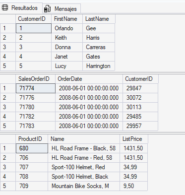
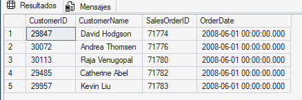
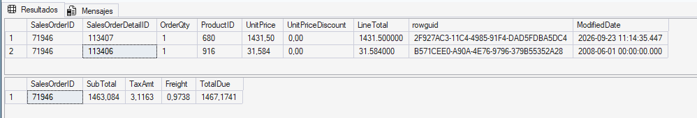
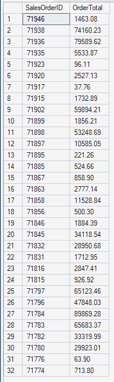
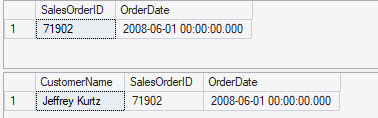
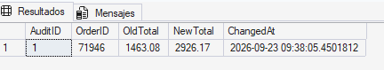

# Desarrollo del laboratorio 02

## 1. Verificación de AdventureWorksLT

Primero se verificó que la base de datos **AdventureWorksLT** estuviera correctamente instalada y accesible.

``` sql
 -- Verificar clientes
SELECT TOP (5)
    CustomerID,
    FirstName,
    LastName
FROM SalesLT.Customer;
GO

-- Verificar pedidos
SELECT TOP (5)
    SalesOrderID,
    OrderDate,
    CustomerID
FROM SalesLT.SalesOrderHeader;
GO

-- Verificar productos
SELECT TOP (5)
    ProductID,
    Name,
    ListPrice
FROM SalesLT.Product;
GO
```

El resultado que aparece al ejecutar ese código son tres tablas
 

## 2. Creación de una View

Se creó la vista `SalesLT.vCustomerOrders` para combinar información de clientes y pedidos.

```sql
CREATE OR ALTER VIEW SalesLT.vCustomerOrders AS
SELECT 
    c.CustomerID,
    CONCAT(c.FirstName, ' ', c.LastName) AS CustomerName,
    h.SalesOrderID,
    h.OrderDate
FROM SalesLT.Customer c
INNER JOIN SalesLT.SalesOrderHeader h 
    ON c.CustomerID = h.CustomerID;
```

Se muestran los cinco pedidos más recientes utilizando la
vista recién creada.

```sql
SELECT TOP (5) * 
FROM SalesLT.vCustomerOrders 
ORDER BY OrderDate DESC;
```

El resultado al consultar la vista `SalesLT.vCustomerOrders`
 

## 3. Creación de un Stored Procedure

Se creó el procedimiento almacenado: `dbo.AddOrderLineItem`

Su objetivo es insertar una nueva línea de producto en un pedido existente y actualizar posteriormente el subtotal del pedido.

``` sql
CREATE OR ALTER PROCEDURE dbo.AddOrderLineItem
    @SalesOrderID INT,
    @ProductID    INT,
    @Quantity     INT
AS
BEGIN
    SET NOCOUNT ON;

    BEGIN TRANSACTION;

    -- Obtener el precio de lista del producto
    DECLARE @UnitPrice DECIMAL(18,2);

    SELECT @UnitPrice = CAST(ListPrice AS DECIMAL(18,2))
    FROM SalesLT.Product
    WHERE ProductID = @ProductID;

    -- Comprobar que el producto existe
    IF @UnitPrice IS NULL
    BEGIN
        ROLLBACK TRANSACTION;
        THROW 50010, 'El ProductID especificado no es válido.', 1;
    END;

    -- Comprobar que el pedido existe
    IF NOT EXISTS
    (
        SELECT 1
        FROM SalesLT.SalesOrderHeader
        WHERE SalesOrderID = @SalesOrderID
    )
    BEGIN
        ROLLBACK TRANSACTION;
        THROW 50011, 'El SalesOrderID especificado no es válido.', 1;
    END;

    -- Insertar una nueva línea de pedido sin descuento
    INSERT INTO SalesLT.SalesOrderDetail
    (
        SalesOrderID,
        OrderQty,
        ProductID,
        UnitPrice,
        UnitPriceDiscount
    )
    VALUES
    (
        @SalesOrderID,
        @Quantity,
        @ProductID,
        @UnitPrice,
        0
    );

    -- Recalcular el subtotal del pedido
    UPDATE h
    SET
        SubTotal = d.SumLineTotal,
        ModifiedDate = SYSUTCDATETIME()
    FROM SalesLT.SalesOrderHeader AS h
    INNER JOIN
    (
        SELECT
            SalesOrderID,
            SUM(LineTotal) AS SumLineTotal
        FROM SalesLT.SalesOrderDetail
        WHERE SalesOrderID = @SalesOrderID
        GROUP BY SalesOrderID
    ) AS d
        ON d.SalesOrderID = h.SalesOrderID;

    COMMIT TRANSACTION;
END;
GO
```

Probar el procedimiento almacenado

``` sql
DECLARE @SalesOrderID INT =
(
    SELECT TOP (1) SalesOrderID
    FROM SalesLT.SalesOrderHeader
    ORDER BY SalesOrderID DESC
);

EXEC dbo.AddOrderLineItem
    @SalesOrderID = @SalesOrderID,
    @ProductID = 680,
    @Quantity = 1;

-- Comprobar las líneas del pedido
SELECT TOP (5) *
FROM SalesLT.SalesOrderDetail
WHERE SalesOrderID = @SalesOrderID
ORDER BY SalesOrderDetailID DESC;

-- Comprobar el subtotal actualizado
SELECT
    SalesOrderID,
    SubTotal,
    TaxAmt,
    Freight,
    TotalDue
FROM SalesLT.SalesOrderHeader
WHERE SalesOrderID = @SalesOrderID;
GO
```
Resultado de la ejecución 

 

## 4. Creación de una Scalar Function

Se creó la función: `dbo.fnOrderTotal`

Esta función recibe el identificador de un pedido y devuelve su importe total.

```sql
CREATE OR ALTER FUNCTION dbo.fnOrderTotal (@OrderID INT)
RETURNS DECIMAL(18,2)
AS
BEGIN
    DECLARE @Total DECIMAL(18,2);

    SELECT @Total = SUM(LineTotal)
    FROM SalesLT.SalesOrderDetail
    WHERE SalesOrderID = @OrderID;

    RETURN ISNULL(@Total, 0.00);
END;
```

  Probar la función escalar

```sql
SELECT 
    d.SalesOrderID,
    dbo.fnOrderTotal(d.SalesOrderID) AS OrderTotal
FROM SalesLT.SalesOrderDetail d
GROUP BY d.SalesOrderID
ORDER BY d.SalesOrderID DESC;
```

Una `Scalar Function` devuelve un único valor y puede reutilizarse dentro de otras consultas.
Resultado de la ejecución 

 

## 5. Creación de una Table-Valued Function

Se creó la función:`dbo.GetCustomerOrders`

Esta función recibe un `CustomerID` y devuelve los pedidos correspondientes al cliente.

```sql
CREATE OR ALTER FUNCTION dbo.GetCustomerOrders (@CustomerID INT)
RETURNS TABLE
AS
RETURN
(
    SELECT 
        h.SalesOrderID,
        h.OrderDate
    FROM SalesLT.SalesOrderHeader h
    WHERE h.CustomerID = @CustomerID
);
```

Probar la función con valores de tabla.

```sql
SELECT *
FROM dbo.GetCustomerOrders(29929)
ORDER BY OrderDate DESC;
```

También se utilizó con `CROSS APPLY`:

```sql
SELECT 
    CONCAT(c.FirstName, ' ', c.LastName) AS CustomerName,
    o.SalesOrderID,
    o.OrderDate
FROM SalesLT.Customer c
CROSS APPLY dbo.GetCustomerOrders(c.CustomerID) o
WHERE c.CustomerID = 29929;
```

La función permite utilizar un resultado parametrizado como si fuera una tabla dentro de otras consultas.

Resultado de las consultas con la función
 

## 6. Creación de un Trigger

Se creó una tabla de auditoría:`dbo.OrderAudit`

``` sql

IF OBJECT_ID('dbo.OrderAudit') IS NULL
BEGIN
    CREATE TABLE dbo.OrderAudit
    (
        AuditID   INT IDENTITY(1,1) PRIMARY KEY,
        OrderID   INT NOT NULL,
        OldTotal  DECIMAL(18,2) NULL,
        NewTotal  DECIMAL(18,2) NULL,
        ChangedAt DATETIME2 NOT NULL DEFAULT SYSUTCDATETIME()
    );
END;
GO
```
El objetivo es registrar automáticamente los cambios en el importe de los pedidos.

La tabla de auditoría almacena:

- Identificador del pedido.
- Total anterior.
- Total nuevo.
- Fecha y hora del cambio.

Posteriormente se creó el trigger: `SalesLT.trg_LogOrderTotalChange`
El trigger identifica los pedidos afectados mediante las
tablas lógicas inserted y deleted.

Después calcula:
- El nuevo total.
- La contribución de las filas nuevas.
- La contribución de las versiones anteriores.

Finalmente registra el cambio en dbo.OrderAudit.

``` sql

CREATE OR ALTER TRIGGER SalesLT.trg_LogOrderTotalChange
ON SalesLT.SalesOrderDetail
AFTER INSERT, UPDATE
AS
BEGIN
    SET NOCOUNT ON;

    ;WITH AffectedOrders AS
    (
        SELECT SalesOrderID
        FROM inserted

        UNION

        SELECT SalesOrderID
        FROM deleted
    ),

    -- Totales actuales después de aplicar el cambio
    NewTotals AS
    (
        SELECT
            d.SalesOrderID,
            SUM(d.OrderQty * d.UnitPrice) AS Total
        FROM SalesLT.SalesOrderDetail AS d
        INNER JOIN AffectedOrders AS a
            ON d.SalesOrderID = a.SalesOrderID
        GROUP BY d.SalesOrderID
    ),

    -- Contribución de las filas insertadas o modificadas
    InsertedTotals AS
    (
        SELECT
            SalesOrderID,
            SUM(OrderQty * UnitPrice) AS Total
        FROM inserted
        GROUP BY SalesOrderID
    ),

    -- Contribución de las versiones anteriores de las filas
    DeletedTotals AS
    (
        SELECT
            SalesOrderID,
            SUM(OrderQty * UnitPrice) AS Total
        FROM deleted
        GROUP BY SalesOrderID
    )

    INSERT INTO dbo.OrderAudit
    (
        OrderID,
        OldTotal,
        NewTotal
    )
    SELECT
        n.SalesOrderID,
        n.Total - ISNULL(i.Total, 0) + ISNULL(d.Total, 0) AS OldTotal,
        n.Total AS NewTotal
    FROM NewTotals AS n
    LEFT JOIN InsertedTotals AS i
        ON n.SalesOrderID = i.SalesOrderID
    LEFT JOIN DeletedTotals AS d
        ON n.SalesOrderID = d.SalesOrderID;
END;
GO
```


Para comprobar su funcionamiento se modificó la cantidad de un producto:

```sql
UPDATE d
SET OrderQty = OrderQty + 1
FROM SalesLT.SalesOrderDetail AS d
WHERE d.SalesOrderID =
(
    SELECT TOP (1) SalesOrderID
    FROM SalesLT.SalesOrderHeader
    ORDER BY SalesOrderID DESC
);
GO

-- Consultar los últimos registros de auditoría
SELECT TOP (5) *
FROM dbo.OrderAudit
ORDER BY AuditID DESC;
GO
```

El registro generado confirma que el trigger se ejecutó automáticamente después de la modificación.


## Objetos creados

| Tipo | Objeto |
|---|---|
| View | `SalesLT.vCustomerOrders` |
| Stored Procedure | `dbo.AddOrderLineItem` |
| Scalar Function | `dbo.fnOrderTotal` |
| Table-Valued Function | `dbo.GetCustomerOrders` |
| Audit Table | `dbo.OrderAudit` |
| Trigger | `SalesLT.trg_LogOrderTotalChange` |

